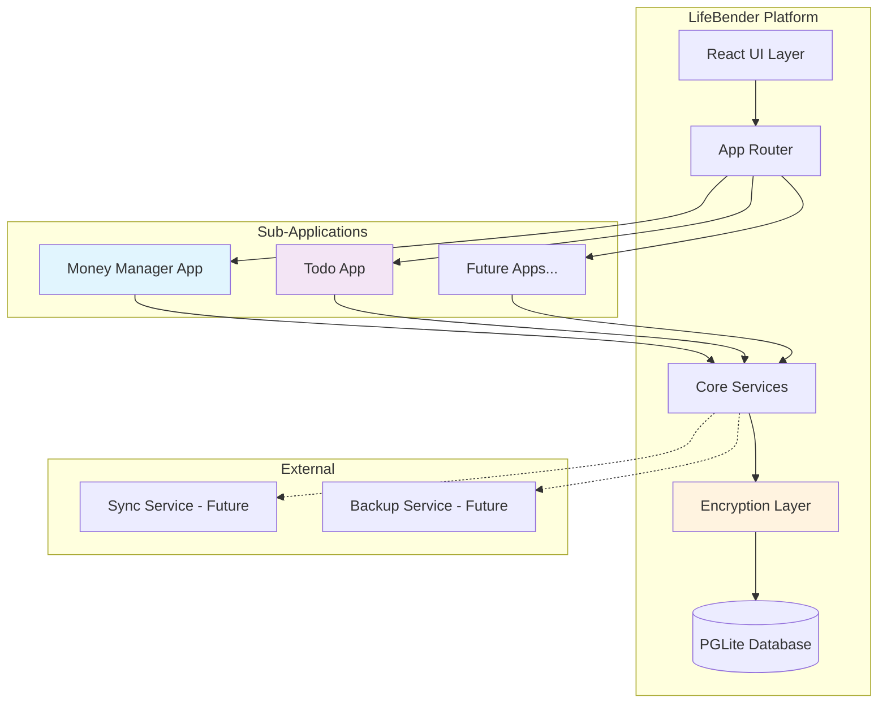
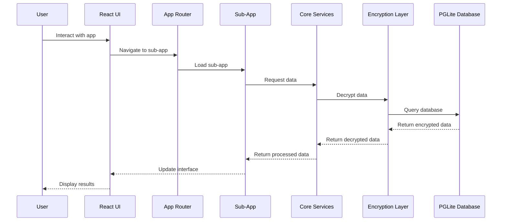
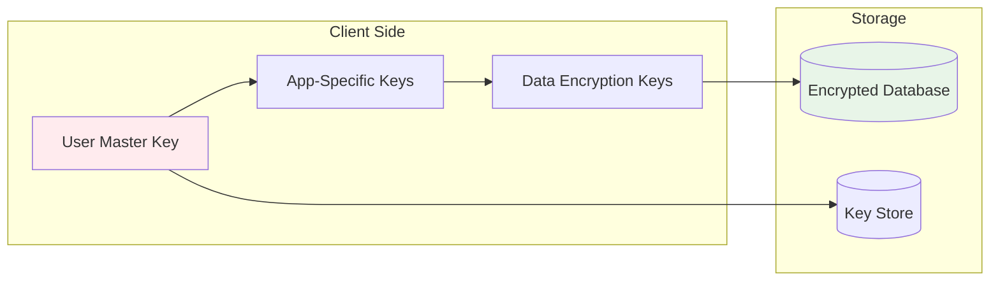

# LifeBender - Offline-First Multi-App Platform

A secure, offline-first application platform built with modern technologies for managing personal data with end-to-end encryption.

## 🎯 Overview

LifeBender is a desktop application that provides multiple sub-applications within a single platform, prioritizing offline functionality and data security. The platform uses end-to-end encryption to protect sensitive financial data and personal information.

## 🏗️ Architecture

### Technology Stack

- **Runtime**: [Bun](https://bun.com/) - Fast JavaScript runtime
- **Build Tool**: [Vite](https://vite.dev/) - Next-generation frontend tooling
- **Frontend**: React + TypeScript
- **UI Library**: [HeroUI](https://www.heroui.com/) - Beautiful, fast and modern React UI library
- **Routing**: [TanStack Router](https://tanstack.com/router/latest) - Type-safe routing with built-in data fetching
- **Styling**: [Tailwind CSS](https://tailwindcss.com/) - Utility-first CSS framework
- **Component Development**: [Storybook](https://storybook.js.org/) - Component development and testing
- **Database**: [PGLite](https://pglite.dev/) - SQLite-compatible database with PostgreSQL syntax
- **ORM**: [Drizzle](https://orm.drizzle.team/) - Type-safe SQL toolkit with PGLite support
- **Validation**: [Zod](https://zod.dev/) - TypeScript-first schema validation
- **Linting**: [Ultracite](https://www.ultracite.ai/) - AI-powered code quality
- **Desktop Framework**: [Tauri](https://tauri.app/) - Cross-platform desktop app framework
- **Encryption**: End-to-end encryption for sensitive data

### System Architecture



### Data Flow Architecture



### Encryption Architecture



## 📋 Requirements

### Documentation & Development Guidelines

#### TanStack Router Documentation
- **Comprehensive Guides**: Detailed routing patterns, authentication, and advanced features available in `.cursor/rules/`
- **File-Based Routing**: Recommended approach using `src/routes/` directory structure
- **Type Safety**: 100% inferred TypeScript support for routes, params, and search params
- **Data Fetching**: Built-in loaders with SWR caching for optimal performance
- **Authentication**: Protected routes with `beforeLoad` and redirect patterns
- **Code Splitting**: Automatic code splitting for better performance
- **Search Params**: Type-safe JSON-first search parameter management

#### HeroUI Component Library
- **Accessible Components**: Built-in accessibility features and WCAG compliance
- **Theming**: Dark/light mode support with customizable themes
- **Mobile-First**: Optimized components for touch interactions
- **Storybook Integration**: Component development and testing workflow
- **TypeScript Support**: Full type safety for all components

### Core Platform Requirements

#### 1. Offline-First Architecture
- **Primary Requirement**: All functionality must work without internet connection
- **Data Storage**: Local PGLite database with encrypted storage
- **Sync Capability**: Future feature for optional cloud synchronization
- **Offline Indicators**: Clear UI indicators when offline/online

#### 2. Security & Encryption
- **End-to-End Encryption**: All sensitive data encrypted at rest
- **Master Key**: User-defined master password for key derivation
- **App-Level Keys**: Separate encryption keys for each sub-application
- **Key Derivation**: PBKDF2 or Argon2 for key derivation
- **Encryption Algorithm**: AES-256-GCM for data encryption
- **Key Storage**: Secure local storage with hardware-backed encryption when available

#### 3. Multi-App Architecture
- **Modular Design**: Each sub-app is a separate module
- **Shared Services**: Common services for authentication, encryption, database
- **App Switching**: Seamless navigation between sub-applications
- **Data Isolation**: Each app has isolated data storage
- **Shared Components**: Reusable UI components across apps

#### 4. Performance Requirements
- **Fast Startup**: < 2 seconds cold start
- **Responsive UI**: < 100ms response time for user interactions
- **Memory Efficient**: < 500MB RAM usage
- **Storage Efficient**: Optimized database queries and storage
- **Mobile-First**: Optimized for small screen interactions
- **Touch-Friendly**: Large touch targets and gesture support

### Sub-Application Requirements

#### Money Manager App
- **Account Management**: Multiple financial accounts (checking, savings, credit cards)
- **Transaction Tracking**: Income and expense tracking with categories
- **Budget Planning**: Monthly/yearly budget creation and tracking
- **Reports & Analytics**: Spending patterns, income analysis, net worth tracking
- **Data Import**: CSV/OFX import for bank statements
- **Encryption**: All financial data encrypted with app-specific keys

#### Todo App
- **Task Management**: Create, edit, delete, complete tasks
- **Categories**: Organize tasks by categories/projects
- **Priority Levels**: High, medium, low priority tasks
- **Due Dates**: Set and track due dates with reminders
- **Recurring Tasks**: Daily, weekly, monthly recurring tasks
- **Search & Filter**: Advanced search and filtering capabilities

### Technical Requirements

#### Development Environment
- **Node.js Alternative**: Use Bun for faster development
- **Build System**: Vite for fast hot reload and optimized builds
- **Type Safety**: Full TypeScript implementation with Zod validation
- **UI Library**: HeroUI for beautiful, accessible React components with built-in theming
- **Routing**: TanStack Router for type-safe routing with built-in data fetching and offline support
- **ORM**: Drizzle with PGLite for type-safe database operations and migrations
- **Styling**: Tailwind CSS for utility-first styling and mobile-first design
- **Component Development**: Storybook for component development, testing, and styleguide
- **Code Quality**: Ultracite for AI-powered linting and code quality
- **Testing**: Unit tests for core functionality, integration tests for apps
- **Desktop Build**: Tauri for cross-platform desktop deployment

#### Database Requirements
- **Schema Design**: Normalized database schema for each app
- **Migration System**: Drizzle Kit for version-controlled database migrations
- **Type Safety**: Drizzle ORM for type-safe database operations
- **Backup System**: Automatic local backups with encryption
- **Query Optimization**: Efficient queries for large datasets
- **PGLite Integration**: Full compatibility with Drizzle ORM and migration system

#### UI/UX Requirements
- **Mobile-First Design**: Optimized for phone screens and touch interactions
- **Responsive Design**: Works on different screen sizes
- **Design System**: HeroUI components with Storybook for development and styleguide
- **Styling**: HeroUI + Tailwind CSS for utility-first styling and consistency
- **Dark/Light Mode**: HeroUI's built-in theme switching capability
- **Accessibility**: WCAG 2.1 AA compliance with HeroUI's accessibility features
- **Touch Navigation**: Gesture-based navigation and large touch targets
- **Offline Indicators**: Clear status indicators
- **Cross-Platform**: Tauri for desktop deployment across all environments

## 🚀 Getting Started

### Prerequisites
- Bun runtime (latest version)
- Node.js 18+ (for some tooling)
- Git

### Installation
```bash
# Clone the repository
git clone <repository-url>
cd lifebender

# Install dependencies
bun install

# Start development server
bun run dev

# Build for production
bun run build
```

### Development Commands
```bash
# Start development server
bun run dev

# Run tests
bun run test

# Run linting with Ultracite
bun run lint

# Component development and testing
bun run storybook      # Start Storybook
bun run storybook:build # Build Storybook for deployment

# Database migrations
bun run db:generate    # Generate migrations
bun run db:migrate     # Run migrations
bun run db:studio      # Open Drizzle Studio

# Build for production
bun run build

# Build desktop app with Tauri
bun run tauri:build

# Preview production build
bun run preview
```

## 📁 Project Structure

### Documentation & Development Rules

The project includes comprehensive documentation and development guidelines in `.cursor/rules/`:

- **`lifebender.mdc`**: Project-specific guidelines, architecture patterns, and best practices
- **`ultracite.mdc`**: Code quality rules and linting standards  
- **`tanstack-react-router_*.mdc`**: Complete TanStack Router documentation including:
  - **Guide**: Authentication, code splitting, and advanced patterns
  - **Routing**: File-based routing, route concepts, and configuration
  - **Setup & Architecture**: Installation, configuration, and architectural decisions
  - **API**: Complete API reference and examples

### Application Structure

```
lifebender/
├── src/
│   ├── main.tsx                 # Main application entry
│   ├── App.css                  # Global styles
│   ├── routeTree.gen.ts         # Auto-generated route tree (TanStack Router)
│   ├── routes/                  # File-based routes (TanStack Router)
│   │   ├── __root.tsx          # Root layout with HeroUI provider
│   │   ├── index.tsx           # Home page route
│   │   ├── about.tsx           # About page route
│   │   ├── money-manager/       # Money manager app routes
│   │   └── todo/               # Todo app routes
│   ├── components/              # Shared UI components (HeroUI + custom)
│   ├── core/                    # Core services (auth, crypto, db)
│   ├── apps/                    # Sub-applications
│   │   ├── money-manager/       # Money management app
│   │   └── todo/               # Todo app
│   ├── utils/                   # Utility functions
│   └── types/                   # TypeScript type definitions
├── database/
│   ├── schema/                  # Drizzle schema definitions
│   ├── migrations/              # Database migrations
│   └── drizzle.config.ts        # Drizzle configuration
├── src-tauri/                   # Tauri desktop app configuration
├── .storybook/                  # Storybook configuration
├── stories/                     # Component stories for Storybook
├── public/                      # Static assets
├── tests/                       # Test files
├── docs/                        # Documentation
└── config/                      # Configuration files
```

## 🏗️ Multi-App Structure with TanStack Router

This project uses a modular, file-based routing approach to support multiple sub-applications ("apps") within a single platform. Each app is self-contained and leverages TanStack Router for type-safe, scalable navigation.

### Directory Structure

```
src/
├── main.tsx
├── routeTree.gen.ts
├── routes/
│   ├── __root.tsx                # Root layout (global providers, navigation)
│   ├── index.tsx                 # Home page
│   ├── _authenticated.tsx        # (Optional) Authenticated layout for protected routes
│   ├── login.tsx                 # Login page
│   ├── not-found.tsx             # 404 page
│   ├── money-manager/            # Money Manager app
│   │   ├── index.tsx             # Money Manager dashboard
│   │   ├── accounts.tsx          # Accounts list
│   │   ├── transactions.tsx      # Transactions list
│   │   ├── budget.tsx            # Budget tracking
│   │   └── ...                   # Other money-manager features
│   └── todo/                     # Todo app
│       ├── index.tsx             # Todo dashboard
│       ├── tasks.tsx             # Task list
│       ├── categories.tsx        # Task categories
│       └── ...                   # Other todo features
├── components/                   # Shared UI components
├── core/                         # Shared services (auth, crypto, db, etc.)
├── apps/                         # (Optional) App-specific business logic
├── utils/                        # Utility functions
├── types/                        # TypeScript types
```

### Routing Patterns

- **Root Layout (`__root.tsx`)**: Global providers, navigation, error boundaries.
- **Sub-App Entry Points**: Each app has its own directory under `routes/` with an `index.tsx` as the dashboard/landing page.
- **Nested Features**: App-specific features are additional files within each app’s directory.
- **Authentication**: Use `_authenticated.tsx` as a layout route to wrap all protected routes. Implement `beforeLoad` for auth checks.
- **Error Handling**: Use `not-found.tsx` for 404s and error boundaries in root or app layouts.

### Example Route URLs

- `/` → Home
- `/login` → Login
- `/money-manager` → Money Manager dashboard
- `/money-manager/accounts` → Accounts list
- `/money-manager/transactions` → Transactions
- `/todo` → Todo dashboard
- `/todo/tasks` → Task list
- `/todo/categories` → Task categories

### Best Practices

- **Isolation**: Each app’s routes, components, and logic are isolated in their own directory.
- **Shared Core**: Use `core/` for shared services and `components/` for shared UI.
- **Type Safety**: Leverage TanStack Router’s type-safe loaders, params, and search params.
- **Code Splitting**: File-based routing enables automatic code splitting for each app and feature.
- **Offline-First**: All apps should work offline, using local storage and proper offline indicators.
- **Mobile-First**: Design all components and layouts for mobile usability.

### Extending the Platform

- **Add New Apps**: Create a new directory under `routes/` (e.g., `notes/`, `passwords/`) and follow the same structure.
- **App-Specific Providers**: Use layout routes (e.g., `money-manager/_layout.tsx`) for app-specific context/providers.
- **Protected Apps**: Place sensitive apps under `_authenticated/` or use `beforeLoad` in their entry points.

### Documentation References

- See `.cursor/rules/tanstack-react-router_guide.mdc` for advanced routing, authentication, and code splitting patterns.
- See `.cursor/rules/lifebender.mdc` for project-specific architecture and security guidelines.

---

## 🔐 Security Considerations

### Encryption Implementation
- **Key Derivation**: Use PBKDF2 with 100,000+ iterations
- **Salt Generation**: Cryptographically secure random salts
- **Key Storage**: Secure local storage with hardware backing when available
- **Memory Protection**: Clear sensitive data from memory after use
- **Key Rotation**: Support for future key rotation without data loss

### Data Protection
- **Sensitive Data**: Financial information, personal notes, passwords
- **Non-Sensitive Data**: App preferences, UI settings
- **Data Classification**: Clear classification of sensitive vs non-sensitive data
- **Audit Trail**: Logging of data access (local only)

## 🧪 Testing Strategy

### Test Types
- **Unit Tests**: Core services, encryption, database operations
- **Component Tests**: Storybook for component testing and visual regression
- **Integration Tests**: App-to-app communication, data flow
- **E2E Tests**: Complete user workflows
- **Security Tests**: Encryption validation, key management

### Test Coverage Goals
- **Core Services**: 90%+ coverage
- **UI Components**: 80%+ coverage
- **Critical Paths**: 100% coverage

## 📈 Future Roadmap

### Phase 1: Core Platform (Current)
- [ ] Basic platform architecture
- [ ] Encryption layer implementation
- [ ] Database setup and migrations
- [ ] Money Manager app
- [ ] Todo app

### Phase 2: Enhanced Features
- [ ] Data synchronization (optional)
- [ ] Cloud backup (encrypted)
- [ ] Mobile companion app
- [ ] Advanced analytics

### Phase 3: Additional Apps
- [ ] Password Manager
- [ ] Document Storage
- [ ] Health Tracker
- [ ] Project Manager

## 🤝 Contributing

### Development Guidelines
- **Code Style**: Follow TypeScript best practices
- **Testing**: Write tests for new features
- **Security**: All security-related code must be reviewed
- **Documentation**: Update docs for new features

### Pull Request Process
1. Create feature branch
2. Implement changes with tests
3. Run linting and tests
4. Submit PR with detailed description
5. Code review and approval

## 📄 License

[License information to be added]

## 🆘 Support

For support and questions:
- Create an issue in the repository
- Check the documentation in `/docs`
- Review the troubleshooting guide

---

**Note**: This is a work in progress. Requirements and architecture may evolve based on development needs and user feedback. 